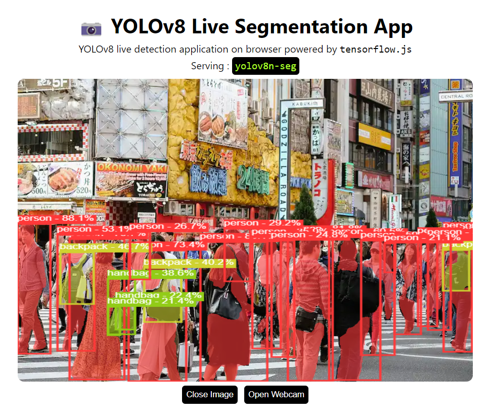

# Object Segmentation Application Using YOLOv8 and Tensorflow.js

<p align="center">
  
</p>


---

Object Segmentation application right in your browser. Serving YOLOv8-Seg in browser using
tensorflow.js with `webgl` backend.

**Setup**

```bash
git clone https://github.com/Hyuto/yolov8-seg-tfjs.git
cd yolov8-seg-tfjs
yarn install #Install dependencies
```

**Scripts**

```bash
yarn start # Start dev server
yarn build # Build for productions
```

## Model

YOLOv8n-Seg model converted to tensorflow.js.

```
used model : yolov8n-seg
size       : 14 Mb
```

## Reference

- https://github.com/ultralytics/ultralytics
- https://github.com/Hyuto/yolov8-seg-onnxruntime-web
